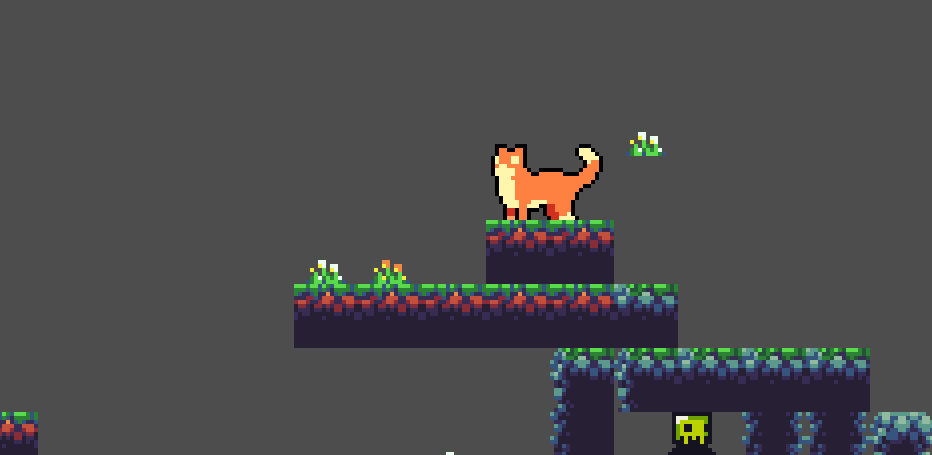
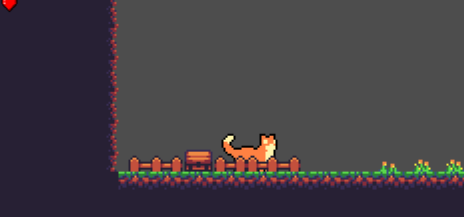
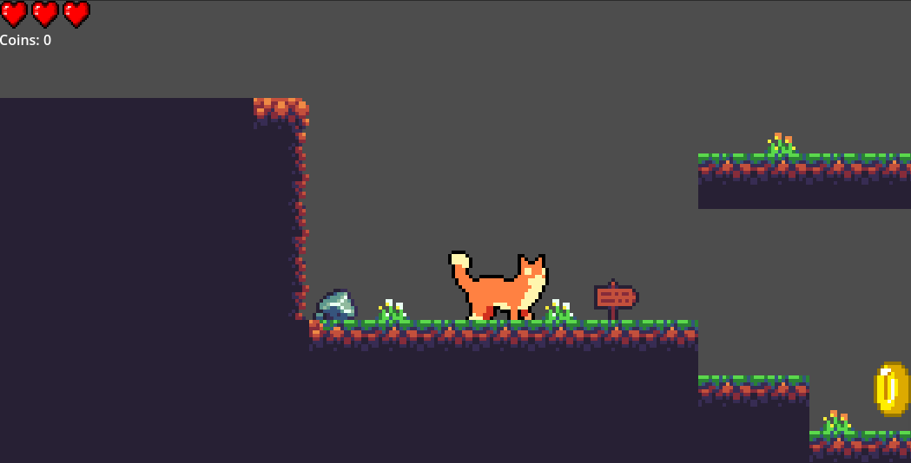
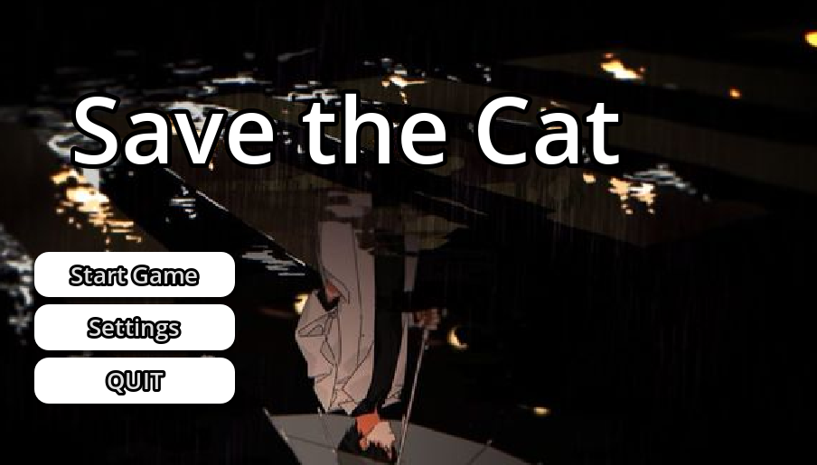

# Save The Cat

A 2D platformer built with Godot 4. Play as a cat navigating handcrafted levels, collecting coins, and dodging patrolling slime across multiple stages.

🎮 **[Play the Web Build on itch.io](https://sainath-shinde.itch.io/save-the-cat)**

---

## Gameplay & Screenshots

Gameplay Screenshot

  
  
    
  
  

## Features

- **Responsive 2D Platforming:** Custom jump physics, collision handling, and smooth movement.
- **Health & Life Management:** 3-heart life system handled globally across scenes via autoload.
- **Interactive Enemies:** Patrolling slime with dynamic raycasts detecting collisions and attacks.
- **Audio Controls:** Custom settings menu featuring a mute button and sound volume.

### 🎮 Supported Platforms
* **Windows** (Executable `.exe`)
* **Android** (Direct `.apk` install with on-screen touch controls)
* **Web** (Playable directly in browser via itch.io)

---

## Controls

| Key | Action |
| :--- | :--- |
| **A / D** or **Left / Right Arrow** | Move Left / Right |
| **Space / W / Up Arrow** | Jump |
| **Esc** | Pause / Back to Menu |

---

## Tech Stack & Architecture

- **Engine:** Godot Engine 4 (GDScript)
- **Deployment:** WebAssembly (HTML5 / itch.io)
- **Key Singletons (Autoloads):**
  - `GameController`: Tracks player health, total coin counts, and persistent background music
